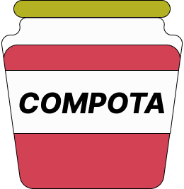

# COMPOTA

## 由来

compositor(動画などの合成をするもの)の響きからcompota(コンポタ)という名前を思いつきました。
スペイン語圏ではコンポートを指すことがわかったので、ロゴには瓶詰めのコンポートを使用しました。(名前を思いついたときにはコーンポタージュにしようと思っていました。)

[英語](README-en.md)

## サービスのページ

[Compota](https://chroma-key-front-1056921343497.asia-northeast2.run.app)

## APIリポジトリ

[Compota API](https://github.com/IamSBStakumi/chroma-key-api)

## このアプリについて

このアプリでは、動画に背景となる画像を合成することができます。
このアプリを使用することで、Webサイト上で簡単に動画の合成を行うことができます。
使用方法はグリーンバックで撮影した動画と背景にしたい画像をアップロードするだけです。

ショート動画をサイトに投稿したいが、背景を合成するためのパソコンや有料の編集ソフトといった機材がないという方に使用していただくことを目的としています。
もちろん、上記に当てはまらない方にも自由に使用していただけます。

データベースを使用していないため、合成に使用する動画や画像を保存することはしていません。

現在、グリーンバックを使用した動画にのみ対応していますが、今後機能を拡張していくことを考えています。

### 動作確認済

#### 動画

- mp4ファイル
  - 約1分程度のグリーンバックにおいて撮影された動画

#### 画像

- pngファイル
- jpegファイル

## 技術スタック

### フロントエンド

### バックエンド

### テスト

### 環境構築

#### 共通

#### バックエンドのみ

## インフラ

### linter/formatter

## スクリーンショット

以下の画面から、動画の合成を行うことができます。

以下の画面から、不具合や要望を投稿することができます。

